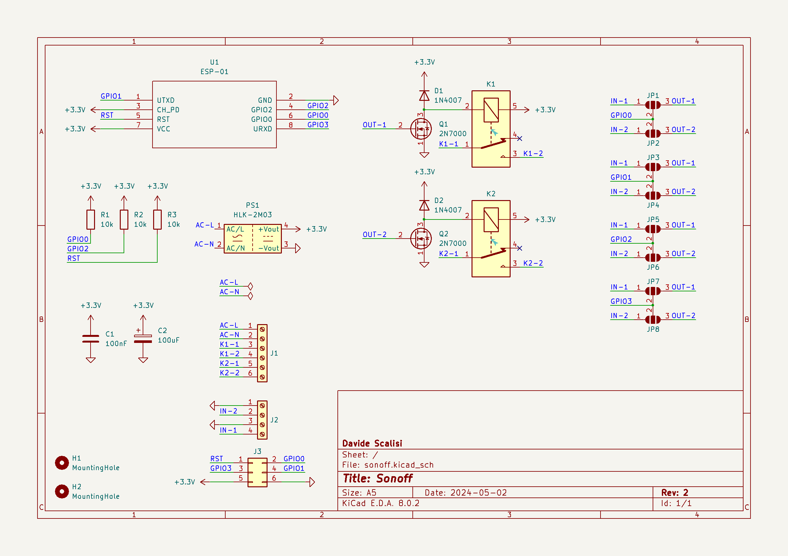
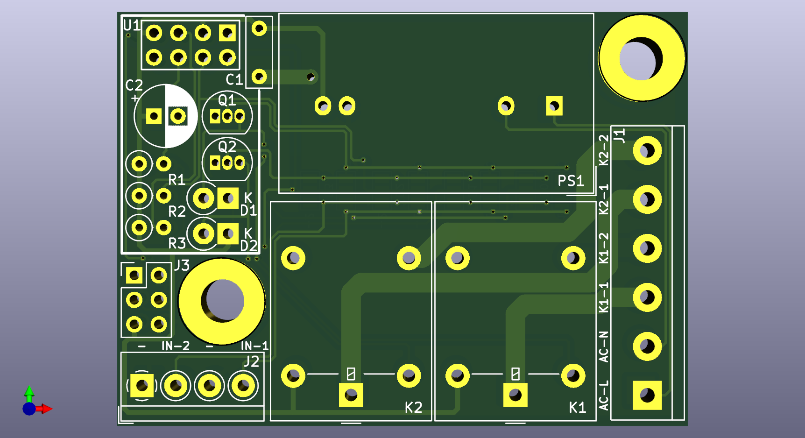

# DIY-Sonoff
Simple sonoff based on the ESP-01 devboard.

# Requirements
To download the needed KiCad libraries, you must `cd schematics/lib` and run the [clone.sh](schematics/lib/clone.sh) script.

# 3D enclosure
The STL files for the 3D enclosure could be retrived [here](https://www.tinkercad.com/things/9bSfBo0S5Wv-diy-sonoff-enclosure).

# Assembly
- You must check the size of the `C2` capacitor before soldering it because it can be too high to be mounted under the ESP-01 module.
- The `R3` resistor must be mounted if you are going to use the `RST` pin on the `J3` header, otherwise you can place a short circuit instead.
- When you have finished mounting everything, you must map the ESP-01 GPIOs to the corresponding input and outputs.

# GPIOs mapping
You can map the four ESP-01 GPIOs by using the solder pads `JPx` on the back of the PCB. For example, if you want to use the GPIO2 as an output to control the `K2` relay, you can put a solder bridge on `JP6` between the `GPIO2` and `OUT-2` labels. This feature has been introduced in this version because of the behaviour of the GPIOs during the bootloader stage and to make the circuit fully adaptable to every possible situation.

## Inputs and outputs
On the PCB, the `IN-x` pads are shorted directly to the screw terminal `J2`, while the `OUT-x` pads are shorted to the gate pin of the corresponding `Qx` MOSFET.

## ESP8266 bootloader GPIOs configurations
When booting an ESP8266 microcontroller, the bootloader reads the following pins to establish the boot configuration:

| GPIO15 | GPIO0 | GPIO2 | Boot mode                            |
|:------:|:-----:|:-----:|--------------------------------------|
|   LOW  |  LOW  |  HIGH | Serial programming (bootloader mode) |
|   LOW  |  HIGH |  HIGH | Boot from flash                      |
|  HIGH  |  ANY  |  ANY  | Boot from SD card                    |

**Note**: On the ESP-01 dev board, the GPIO15 is not exposed and is held low by the hardware, so you can ignore the first column.

Said that, when booting the already programmed module, you must ensure that the second column configuration is selected. That's accomplished by the resistors `R1` and `R2` on the PCB.

## ESP8266 GPIOs behaviour
|  GPIO |                                 Input                                 |                                                                         Output                                                                        |        Bootloader behaviour        |                  Notes                 |
|:-----:|:---------------------------------------------------------------------:|:-----------------------------------------------------------------------------------------------------------------------------------------------------:|:----------------------------------:|:--------------------------------------:|
| GPIO0 | It must be held high during the boot phase. After, pulled up by `R1`. |                                                     Pulled up at boot by `R1`. After, it's clean.                                                     |          Pulled up by `R1`         |        Boot fails if pulled low.       |
| GPIO1 |              It must be held high during the boot phase.              | It's the UART TX pin and when booting, the bootloader sends out debug data for ~8ms. For that reason, you should not use that pin to control a relay. |    Bootloader UART debug output    | Boot fails if pulled low. UART TX pin. |
| GPIO2 | It must be held high during the boot phase. After, pulled up by `R2`. |                                                     Pulled up at boot by `R2`. After, it's clean.                                                     | High at boot and pulled up by `R2` |        Boot fails if pulled low.       |
| GPIO3 |                                 Clean                                 |                                   It's the UART RX pin. It's should be high at boot but other than that, it's clean.                                  |            High at boot            |              UART RX pin.              |

## Suggested configurations
**Smart plug**
|   \   | IN-1 | IN-2 | OUT-1 | OUT-2 |
|:-----:|:----:|:----:|:-----:|:-----:|
| GPIO0 |      |      |   X   |       |
| GPIO1 |      |      |       |       |
| GPIO2 |      |      |       |   X   |
| GPIO3 |      |      |       |       |

**Sonoff**
|   \   | IN-1 | IN-2 | OUT-1 | OUT-2 |
|:-----:|:----:|:----:|:-----:|:-----:|
| GPIO0 |      |      |   X   |       |
| GPIO1 |   X  |      |       |       |
| GPIO2 |      |      |       |   X   |
| GPIO3 |      |   X  |       |       |

# Circuit and PCB

# Previews

